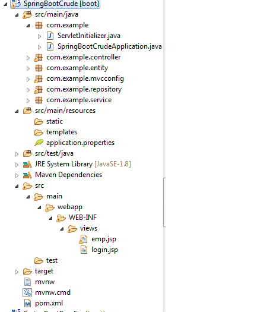
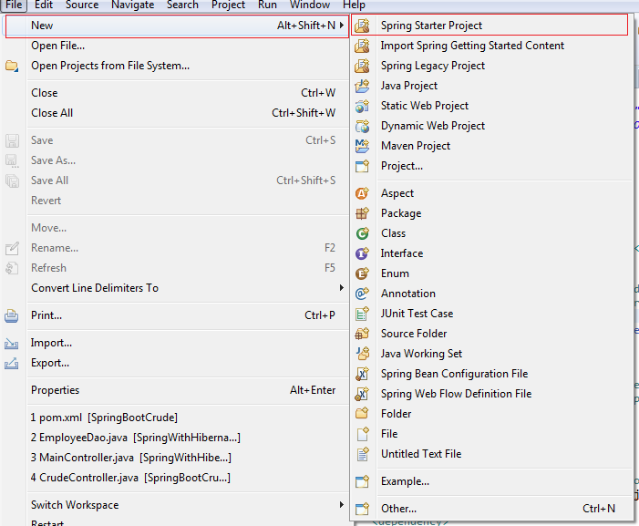
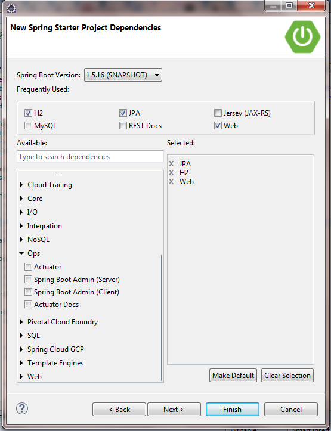

# SpringBootWithAjaxCall

> In this tutorial you will know how to create Spring boot 1.5.3 MVC  example in simplest way.
### Project Structure




#### Step 1 - Let’s Setup Environment

1. Spring 1.5.16.BUILD-SNAPSHOT and any latest version
2. Maven 3 and any latest version
3. JDK 1.6 / JDK 1.7 / JDK 1.8 / JDK 1.9
4. Eclipse Kepler / Eclipse Juno / Eclipse Neon
5. Tomcat 6 / Tomcat 7 / Tomcat 8 / Tomcat 9

#### Step 2 - Create Project

> Click on File > New > Dynamic Web Project





#### Step 3 - Add Dipendency in ``pom.xml`` file

```XML
<?xml version="1.0" encoding="UTF-8"?>
<project xmlns="http://maven.apache.org/POM/4.0.0" xmlns:xsi="http://www.w3.org/2001/XMLSchema-instance"
	xsi:schemaLocation="http://maven.apache.org/POM/4.0.0 http://maven.apache.org/xsd/maven-4.0.0.xsd">
	<modelVersion>4.0.0</modelVersion>

	<groupId>com.example</groupId>
	<artifactId>SpringBootCrude</artifactId>
	<version>0.0.1-SNAPSHOT</version>
	<packaging>war</packaging>

	<name>SpringBootCrude</name>
	<description>Demo project for SpringBootCrude</description>

	<parent>
		<groupId>org.springframework.boot</groupId>
		<artifactId>spring-boot-starter-parent</artifactId>
		<version>1.5.16.BUILD-SNAPSHOT</version>
		<relativePath/> <!-- lookup parent from repository -->
	</parent>

	<properties>
		<project.build.sourceEncoding>UTF-8</project.build.sourceEncoding>
		<project.reporting.outputEncoding>UTF-8</project.reporting.outputEncoding>
		<java.version>1.8</java.version>
	</properties>

	<dependencies>
		<dependency>
			<groupId>org.springframework.boot</groupId>
			<artifactId>spring-boot-starter-data-jpa</artifactId>
		</dependency>
		<dependency>
			<groupId>org.springframework.boot</groupId>
			<artifactId>spring-boot-starter-web</artifactId>
		</dependency>

		<dependency>
			<groupId>com.h2database</groupId>
			<artifactId>h2</artifactId>
			<scope>runtime</scope>
		</dependency>
		<dependency>
			<groupId>mysql</groupId>
			<artifactId>mysql-connector-java</artifactId>
			<scope>runtime</scope>
		</dependency>
		<dependency>
			<groupId>org.springframework.boot</groupId>
			<artifactId>spring-boot-starter-tomcat</artifactId>
			<scope>provided</scope>
		</dependency>
		<dependency>
			<groupId>org.apache.tomcat.embed</groupId>
			<artifactId>tomcat-embed-jasper</artifactId>
		</dependency>
		<dependency>
			<groupId>org.springframework.boot</groupId>
			<artifactId>spring-boot-starter-test</artifactId>
			<scope>test</scope>
		</dependency>
	</dependencies>

	<build>
		<plugins>
			<plugin>
				<groupId>org.springframework.boot</groupId>
				<artifactId>spring-boot-maven-plugin</artifactId>
			</plugin>
		</plugins>
	</build>

	<repositories>
		<repository>
			<id>spring-snapshots</id>
			<name>Spring Snapshots</name>
			<url>https://repo.spring.io/snapshot</url>
			<snapshots>
				<enabled>true</enabled>
			</snapshots>
		</repository>
		<repository>
			<id>spring-milestones</id>
			<name>Spring Milestones</name>
			<url>https://repo.spring.io/milestone</url>
			<snapshots>
				<enabled>false</enabled>
			</snapshots>
		</repository>
	</repositories>

	<pluginRepositories>
		<pluginRepository>
			<id>spring-snapshots</id>
			<name>Spring Snapshots</name>
			<url>https://repo.spring.io/snapshot</url>
			<snapshots>
				<enabled>true</enabled>
			</snapshots>
		</pluginRepository>
		<pluginRepository>
			<id>spring-milestones</id>
			<name>Spring Milestones</name>
			<url>https://repo.spring.io/milestone</url>
			<snapshots>
				<enabled>false</enabled>
			</snapshots>
		</pluginRepository>
	</pluginRepositories>


</project>

```


#### Step 4 - Add all package to above structure
first i add com.exmaple.
here i have two class. below is ServletInitializer class
```JAVA
package com.example;

import org.springframework.boot.builder.SpringApplicationBuilder;
import org.springframework.boot.web.support.SpringBootServletInitializer;

public class ServletInitializer extends SpringBootServletInitializer {

	@Override
	protected SpringApplicationBuilder configure(SpringApplicationBuilder application) {
		return application.sources(SpringBootCrudeApplication.class);
	}

}

<!-- End Here -->
```

And second one is SpringBootCrudeApplication
```JAVA
package com.example;

import org.springframework.boot.SpringApplication;
import org.springframework.boot.autoconfigure.SpringBootApplication;

@SpringBootApplication
public class SpringBootCrudeApplication {

	public static void main(String[] args) {
		SpringApplication.run(SpringBootCrudeApplication.class, args);
	}
}
<!-- End Here -->
```
com.example.controller

```JAVA
package com.example.controller;

import java.util.List;

import org.springframework.beans.factory.annotation.Autowired;
import org.springframework.stereotype.Controller;
import org.springframework.ui.Model;
import org.springframework.web.bind.annotation.RequestMapping;
import org.springframework.web.bind.annotation.RequestMethod;
import org.springframework.web.bind.annotation.RequestParam;
import org.springframework.web.bind.annotation.ResponseBody;
import org.springframework.web.bind.annotation.RestController;

import com.example.entity.employee;
import com.example.service.CrudeService;


@Controller
public class CrudeController {
	
	/*@RequestMapping("/")
	public String Login() {
		
		return "la_login";
	}*/
	
	@Autowired
	private CrudeService crudeService;
	
	@RequestMapping(value="/",method = RequestMethod.GET)
	public String home(Model model) {
		System.out.println("starting page load :::: ");
		return "emp";
	}
	
	@RequestMapping(value="/showAll",method = RequestMethod.GET,produces="application/json")
	public @ResponseBody List<employee> updateEmp(Model model){
		List<employee> emplist =crudeService.findAll();
		
		//System.out.println("emp.getId() ::: "+emp.getId());
		System.out.println("showAll ::: ");
		return emplist;
	}
	@RequestMapping(value = "/save",method = RequestMethod.POST,produces="application/json")
	public @ResponseBody Integer save(@RequestParam("fname")String firstname,
			@RequestParam("lname")String lastname,
			@RequestParam("address")String address,
			@RequestParam("gen") String gen, Model model) {
		System.out.println(" save ::: ");
		System.out.println("firstname ::: "+firstname);
		System.out.println("lastname ::: "+lastname);
		System.out.println("address ::: "+address);
		System.out.println("gen ::: "+gen);
		employee emp = new employee();
		emp.setFirstName(firstname);
		emp.setLastName(lastname);
		emp.setAddress(address);
		emp.setGender(gen);
		emp.setDflag(1);
		String message ="";
		int i =0;
		emp=crudeService.save(emp);
		System.out.println("emp.getId() ::: "+emp.getId());
		if(emp.getId() >0) {
			message="success";
			i=1;
		}else {
			message="fail";
			i=2;
		}
		System.out.println("message ::: "+message);
		System.out.println("message ::: "+i);
		return i;
	}
	
	@RequestMapping(value ="editData",method = RequestMethod.GET, produces="application/json")
	public @ResponseBody employee editData(@RequestParam("id") int id) {
		employee emp =crudeService.findById(id);
		return emp;
	}
	
	@RequestMapping(value="/updateEmp",method = RequestMethod.POST,produces="application/json")
	public @ResponseBody Integer updateEmp(@RequestParam("id")int id,@RequestParam("fname")String firstname,@RequestParam("lname")String lastname,
			@RequestParam("address")String address,@RequestParam("gen")String gen,Model model){
		employee emp =crudeService.findById(id);
		emp.setFirstName(firstname);
		emp.setLastName(lastname);
		emp.setAddress(address);
		emp.setDflag(emp.getDflag());
		emp.setGender(gen);
		emp=crudeService.save(emp);
		System.out.println("emp.getId() ::: "+emp.getId());
		String message ="";
		int i =0;
		if(emp.getId() >0) {
			message="success";
			i=1;
		}else {
			message="fail";
			i=2;
		}
		System.out.println("message ::: "+message);
		System.out.println("message ::: "+i);
		return i;
	}
	@RequestMapping(value="/deleteEmp",method = RequestMethod.POST, produces="application/json")
	public @ResponseBody Integer deleteEmp(@RequestParam("id")int id,Model model) {
		employee emp = crudeService.findById(id);
		emp.setFirstName(emp.getFirstName());
		emp.setLastName(emp.getLastName());
		emp.setAddress(emp.getAddress());
		emp.setDflag(0);
		emp.setGender(emp.getGender());
		emp=crudeService.save(emp);
		String message ="";
		int i =0;
		if(emp.getId() >0) {
			message="success";
			i=1;
		}else {
			message="fail";
			i=2;
		}
		System.out.println("message ::: "+message);
		System.out.println("message ::: "+i);
		return i;
		
	}
}
<!-- End Here -->
```
com.example.entity

```JAVA
package com.example.entity;

import javax.persistence.Column;
import javax.persistence.Entity;
import javax.persistence.GeneratedValue;
import javax.persistence.GenerationType;
import javax.persistence.Id;
import javax.persistence.Table;

@Entity
@Table(name="employeep")
public class Crude {
	
	@Id
	//@TableGenerator(name="TABLE_GEN",table="T_GENERATOR",pkColumnName="GEN_KEY",pkColumnValue="TEST",valueColumnName="GEN_VALUE",initialValue=1,allocationSize=1)
	//@GeneratedValue(strategy=GenerationType.TABLE, generator="TABLE_GEN")
	@GeneratedValue(strategy=GenerationType.AUTO)
	@Column(name="id")
	private int id;
	
	@Column(name="firstname")
	private String firstname;
	
	@Column(name ="lastname")
	private String lastname;
	
	@Column(name="address")
	private String address;
	
	/*@Column(name="skill")
	private String skill;*/
	@Column(name="gender")
	private String gender;
	
	//@Transient
	@Column(name="dflag")
	private int dflag;

	public int getId() {
		return id;
	}

	public void setId(int id) {
		this.id = id;
	}

	public String getFirstname() {
		return firstname;
	}

	public void setFirstname(String firstname) {
		this.firstname = firstname;
	}

	public String getLastname() {
		return lastname;
	}

	public void setLastname(String lastname) {
		this.lastname = lastname;
	}

	public String getAddress() {
		return address;
	}

	public void setAddress(String address) {
		this.address = address;
	}

	public String getGender() {
		return gender;
	}

	public void setGender(String gender) {
		this.gender = gender;
	}

	public int getDflag() {
		return dflag;
	}

	public void setDflag(int dflag) {
		this.dflag = dflag;
	}

}

<!-- End Here -->
```

```JAVA
package com.example.entity;

import javax.persistence.Column;
import javax.persistence.Entity;
import javax.persistence.GeneratedValue;
import javax.persistence.GenerationType;
import javax.persistence.Id;
import javax.persistence.Table;

@Entity
@Table(name="emp")
public class employee {
	
	private int id;
	private String lastName;
	private String firstName;
	private String gender;
	private String address;
	private int dflag;
	
	@Id
	@GeneratedValue(strategy=GenerationType.AUTO)
	@Column(name="id")
	public int getId() {
		return id;
	}
	public void setId(int id) {
		this.id = id;
	}
	
	@Column(name="lastname")
	public String getLastName() {
		return lastName;
	}
	public void setLastName(String lastName) {
		this.lastName = lastName;
	}
	
	@Column(name="firstname")
	public String getFirstName() {
		return firstName;
	}
	public void setFirstName(String firstName) {
		this.firstName = firstName;
	}
	
	@Column(name="gender")
	public String getGender() {
		return gender;
	}
	public void setGender(String gender) {
		this.gender = gender;
	}
	
	@Column(name="address")
	public String getAddress() {
		return address;
	}
	public void setAddress(String address) {
		this.address = address;
	}
	
	@Column(name="dflag")
	public int getDflag() {
		return dflag;
	}
	public void setDflag(int dflag) {
		this.dflag = dflag;
	}
}

<!-- End Here -->
```

com.example.mvcconfig
```JAVA
package com.example.mvcconfig;

import org.springframework.context.annotation.Bean;
import org.springframework.context.annotation.Configuration;
import org.springframework.web.servlet.config.annotation.DefaultServletHandlerConfigurer;
import org.springframework.web.servlet.config.annotation.EnableWebMvc;
import org.springframework.web.servlet.config.annotation.ViewControllerRegistry;
import org.springframework.web.servlet.config.annotation.WebMvcConfigurerAdapter;
import org.springframework.web.servlet.view.InternalResourceViewResolver;

@Configuration
@EnableWebMvc
public class MvcConfig extends WebMvcConfigurerAdapter{
	
	/*@Override
	public void addViewControllers(ViewControllerRegistry registry) {
		registry.addViewController("/path").setViewName("emp");
	}*/
	@Override
	public void configureDefaultServletHandling(DefaultServletHandlerConfigurer configurer) {
		configurer.enable();
	}
	
	@Bean
	public InternalResourceViewResolver ViewResolver() {
		InternalResourceViewResolver viewResolver = new InternalResourceViewResolver();
		viewResolver.setPrefix("/WEB-INF/views/");
		viewResolver.setSuffix(".jsp");
		return viewResolver;
	}
}

<!-- End Here -->
```
com.example.repository
```JAVA
package com.example.repository;

import javax.transaction.Transactional;

import org.springframework.data.jpa.repository.JpaRepository;

import com.example.entity.Crude;
import com.example.entity.employee;

@Transactional
public interface CrudeRepository extends JpaRepository<employee, Integer>{

	@Query("select em from employee em where em.dflag =1")
	public List<employee> findAllData();
	//public employee save(employee emp);

	//public employee findById(int id);

}

<!-- End Here -->
```
com.example.service
```JAVA
package com.example.service;

import java.util.List;

import org.springframework.beans.factory.annotation.Autowired;
import org.springframework.stereotype.Service;

import com.example.entity.employee;
import com.example.repository.CrudeRepository;

@Service
public class CrudeService {

	@Autowired
	private CrudeRepository crudeRepository;
	
	
	public employee save(employee emp) {
		
		return crudeRepository.save(emp);
	}


	public employee findById(int id) {
		return crudeRepository.findOne(id);
	}


	public List<employee> findAll() {
		return crudeRepository.findAllData();
	}
	

}

<!-- End Here -->
```

```application.properties
server.port=8081
server.context-path=/path
spring.h2.console.enabled=true
spring.h2.console.path=/h2
spring.datasource.url=jdbc:h2:file:~/h2/employee;DB_CLOSE_ON_EXIT=FALSE
spring.datasource.username=sa
spring.datasource.password=123456
spring.datasource.driver-class-name=org.h2.Driver
#spring.datasource.driverClassName=org.h2.Driver
spring.jpa.hibernate.ddl-auto=update

<!-- End Here -->
```


#### Step 5 - Add View to project ``Webapp\WEB-INF\view\emp.jsp`` file

```JSP
<%@ page language="java" contentType="text/html; charset=ISO-8859-1"
    pageEncoding="ISO-8859-1"%>
<!DOCTYPE html PUBLIC "-//W3C//DTD HTML 4.01 Transitional//EN" "http://www.w3.org/TR/html4/loose.dtd">
<html>
<head>
<meta http-equiv="Content-Type" content="text/html; charset=ISO-8859-1">
<title>Insert title here</title>
	<link href="http://code.jquery.com/ui/1.10.4/themes/ui-lightness/jquery-ui.css" rel="stylesheet"> 
	<script src="http://code.jquery.com/jquery-1.10.2.js"></script>
	<script src="http://code.jquery.com/ui/1.10.4/jquery-ui.js"></script>
	<!-- CSS -->
	<style>
	Table.GridOne 
		{
		 padding: 3px;
		 margin: 0;
		 background: lightyellow;
		 border-collapse: collapse; 
		 width:35%;
		}
	Table.GridOne Td 
		{ 
		 padding:2px;
		 border: 1px solid #ff9900;
		 border-collapse: collapse;
		} 
	</style>
	<script type="text/javascript">
	
	jQuery(document).ready(function() {
		$('#insertBut').hide();
		$('#updateBut').hide();
		
		showAll();
		
	    jQuery("#confirmationDialog").dialog({
	        autoOpen: false,
	        modal: true,
	        title:'insert Data',
	        width:600,
	        height:600,
	        open: function() {
	        	var id = $("#id").val();
	        	if(id == '' ){
	        		$('#insertBut').show();
	        		$('#updateBut').hide();
	        	}else{
	        		$('#insertBut').hide();
	        		$('#updateBut').show();
	        	}
	        },
	        close :function() {
	        	$("#id").val('');
    	    	$("#fname").val('');
    	    	$("#lname").val('');
    	    	$("#gen").val('');
    	    	$("#address").val('');
    	    	
	        	showAll();
	        } 
	    });
	});
	
	function insert(){
		$("#confirmationDialog").dialog("open");
	}
	
	function showAll(){
	      $.ajax({
	              type:"GET",
	              url:"showAll",
	              dataType: "json",
	              success:function(data)
	              { 
	            	  var rows = '';
	                  $.each( data , function( index, item ) {
	                	rows += '<tr><td>' + item.id + '</td>';
	          	  	  	rows += '<td>' + item.firstName + '</td>';
	          	  	  	rows += '<td>' + item.lastName + '</td>';
	          	  	  	rows += '<td>' + item.gender + '</td>';
	          	  		rows += '<td>' + item.address + '</td>';
	          	  		rows += '<td onclick="editAjaxData('+item.id+');" >edit</td>';
	          	  		rows += '<td onclick="deleteAjaxData('+item.id+');" >Delete</td></tr>';
	          	  	  	
	          	  	  });
	          	  	  $('#tblProducts').html(rows);
	              },
	              error:function(xmlHttpRequest, textStatus, errorThrown)
	              {
	                     alert("error");
	              }
	      });
	}
	
	function insertAjaxData(){
    	var fn = $("#fname").val();
  		var ln = $("#lname").val();
  		var gn = $("#gen").val();
  		var add = $("#address").val();
  		console.log("fn ::: "+fn+" ln ::: "+ln+" gn ::: "+gn+" add ::: "+add);
    	$.ajax({
	    	   type: "post",
	    	   url: "save",
	    	   dataType: "json",  
	    	   data:{fname: fn , lname: ln , gen: gn , address: add},
	    	   success: function(data){
	    		  alert('success :::: '+data);
	    	    if(data == 1){
	    	    	
	    	    	alert('inserted');
	    	    	$('#confirmationDialog').dialog('close');
	    	    	//showAll();
	    	    }else{
	    	    	alert('inserting fail');
	    	    	$('#confirmationDialog').dialog('close');
	    	    	//showAll();
	    	    }
	    	   },
	    	   error: function(){      
	    	    alert('Error while request..');
	    	   }
	    });
    }
	function updateAjaxData(){
		var id = $("#id").val();
    	var fn = $("#fname").val();
  		var ln = $("#lname").val();
  		var gn = $("#gen").val();
  		var add = $("#address").val();
    	$.ajax({
	    	   type: "post",
	    	   url: "updateEmp",
	    	   dataType: "json",  
	    	   data:{id: id, fname: fn , lname: ln , gen: gn , address: add},
	    	   success: function(response){
	    	    if(response == 1){
	    	    	alert('updated');
	    	    	$('#confirmationDialog').dialog('close');
	    	    	showAll();
	    	    }else{
	    	    	alert('updated fail ');
	    	    	$('#confirmationDialog').dialog('close');
	    	    	showAll();
	    	    }
	    	   },
	    	   error: function(){      
	    	    alert('Error while request..');
	    	   }
	    });
    }
	
	function editAjaxData(id){
		alert('editAjaxData()'+id);
		
  	  $.ajax({
  	   type: "get",
  	   url: "editData",
  	   dataType: "json",  
  	   data:{id: id },
  	   success: function(response){
  		    alert(response);
  		    $("#id").val(response.id);
    		$("#fname").val(response.firstName);
    		$("#lname").val(response.lastName);
    		$("#gen").val(response.gender);
    		$("#address").val(response.address);
  	    	$("#confirmationDialog").dialog("open");
  	   },
  	   error: function(){      
  	    alert('Error while request..');
  	   }
  	  });
  	}
	
	function deleteAjaxData(id){
  	  $.ajax({
  	   type: "post",
  	   url: "deleteData",
  	   dataType: "json",  
  	   data:{id: id },
  	   success: function(response){
	  	   if(response == 1){
	  		   alert('data deleted success');
	  		   showAll();
	  	   }else{
	  		 alert('data deleted fail');
	  		   showAll();
	  	   }
  	   },
  	   error: function(){      
  	   		alert('Error while request..');
  	   }
  	  });
  	 }
	
	function searchName(){
		var firstname = $("#search").val();
	      $.ajax({
	              type:"GET",
	              url:"searchName",
	              dataType: "json",
	              data:{firstname: firstname },
	              success:function(data)
	              { 
	            	  var rows = '';
	                  $.each( data , function( index, item ) {
	                	rows += '<tr><td>' + item.id + '</td>';
	          	  	  	rows += '<td>' + item.firstname + '</td>';
	          	  	  	rows += '<td>' + item.lastname + '</td>';
	          	  	  	rows += '<td>' + item.gender + '</td>';
	          	  		rows += '<td>' + item.address + '</td>';
	          	  		rows += '<td onclick="editAjaxData('+item.id+');" >edit</td>';
	          	  		rows += '<td onclick="deleteAjaxData('+item.id+');" >Delete</td></tr>';
	          	  	  	
	          	  	  });
	          	  	  $('#tblProducts').html(rows);
	              },
	              error:function(xmlHttpRequest, textStatus, errorThrown)
	              {
	                     alert("error");
	              }
	      });
	}
	</script>
</head>
<body>
	<button id="click" onclick="insert();"> Add New</button>
	
	
	<!-- <input id="search" type="type" name="search"  value=""/>
	<button id="click" onclick="searchName();"> SEARCH</button> -->
				
	<table>
	  <thead>
	  	<tr>
		  <th> Id </th>
		  <th> FirstName </th>
		  <th> Lastname </th>
		  <th> Gender </th>
		  <th> address </th>
		  <th>Action</th>
		</tr>
	  </thead>
	  <tbody id="tblProducts">
	  
	  </tbody>
	</table>
	<div id="confirmationDialog">
        <table class="GridOne">
	        <tr>
				<td>
					<input id="id" type="hidden" name="id"  value=""/>
					<label>First Name</label>
				</td> 
				<td>
					<input id="fname" type="text" name="fname"  value=""/>
				</td>         
			</tr>
			 <tr>
				<td>
					<label>Last Name</label>
				</td> 
				<td>
					<input id="lname" type="text" name="lname"  value=""/>
				</td>         
			</tr>
			 <tr>
				<td>
					<label>Gender</label>
				</td> 
				<td>
					<input id="gen" type="text" name="gen"  value=""/>
				</td>         
			</tr>
			 <tr>
				<td>
					<label>Address</label>
				</td> 
				<td>
					<textarea id="address" name="address" rows="4" cols="8" maxlength="400"></textarea>
				</td>         
			</tr>
			<tr>
				<td>
					<input type="button" id="insertBut" name="submit" onclick="insertAjaxData();" value="submit">
					<input type="button" id="updateBut" name="submit" onclick="updateAjaxData();"  value="update">
				</td>         
			</tr>
			
        </table>
</div>

</body>
</html>
```

# That's it... you are ready to run

> Right Click on Project > Run As > Run on Server > Select Tomcat Server and click ``finish``


## Meta

Pratik Joshi - pratik.joshi7859@gmail.com

Distributed under the GPL V3.0 license. See ``LICENSE`` for more information.
